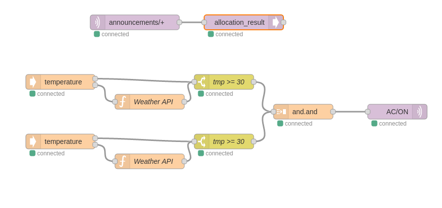

# node-red-contrib-decentralized-computation

Decentralized Computation extensions for Node-RED.

This package provides a platform to distribute the computation of Node-RED flows across edge devices. It introduces an Orchestrator node capable of decomposing and allocating the nodes to multiple IoT devices. Each node is capable of generating its own Micropython code that is to be installed in the edge device running a custom-made firmware.

This platform provides a resilient and decentralized orchestration mechanism capable of handling devices failures in real-time by reallocating the tasks. When it is not possible to allocate a node to a device, due to physical constraints, we introduced a compensate mechanism that allows the user to define an alternative flow to when a specific node fails.

## Use Cases

<figure>
  
  <figcaption>Example flow containing two temperature nodes that can trigger the AC to turn on. If the temperature sensor fails, Node-RED can replace its data by querying a Weather API. </figcaption>
</figure>
